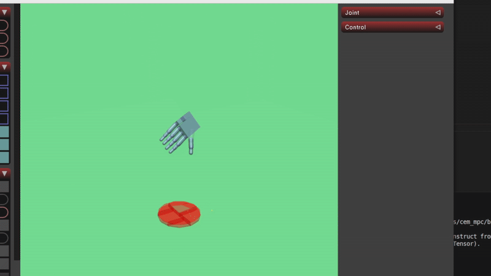
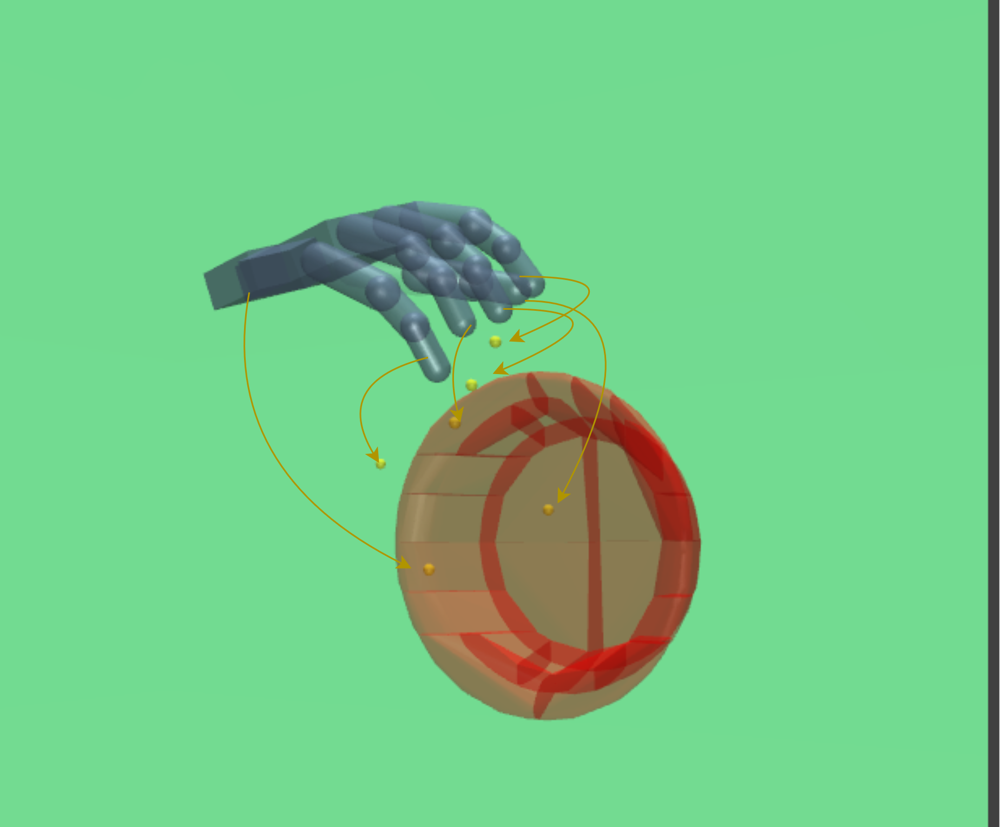

# iCEM MPC Expert

**Introduction**
A framework for robotic grasping using iterative Cross-Entropy Method (iCEM) with Model Predictive Control (MPC). Uses DexGraspNet hand positions for generate optimal approach trajectory.

## Visualizations

Approach trajectory and grasp pose matching:




## Features
- Implementation of iCEM algorithm for robotic control
- MPC-based grasp planning and execution
- Support for multiple object types (bottles, bowls, mugs, etc.)
- Integration with DexGraspNet dataset
- Physics-based simulation environment compatible with RL

## Project Structure
```
.
├── app/                    # Example applications
├── icem_mpc/               # Core implementation
├── mjcf/                   # MuJoCo model files
├── final_positions/        # Pre-computed grasp positions
└── typings/                # Type definitions
```

## Installation
1. Create environment using conda:
```bash
conda env create -f environment.yml
```

2. Install the package:
```bash
pip install -e .
```

## Usage
Check the example scripts in `app/` folder:
- `example_icem_mpc.py` - Basic iCEM-MPC implementation
- `example_env.py` - Environment setup example
- `show_start_poses.py` - Visualization of initial poses

## Reward

The reward function in `reach_pose_env.py` encourages the robot hand to minimize the distance between key points on hand and the target grasp pose. A higher reward is given for precise alignment and successful approach, while penalties are applied for bumping an object.




## Thanks

[DexGraspNet](https://github.com/PKU-EPIC/DexGraspNet) -- for good postions 

[pytorch_icem](https://github.com/UM-ARM-Lab/pytorch_icem) -- for fast and simple implemnatation iCEM

## Dex-EE

The expert trajectories are located in `experts_traj_shadow_dexee` folder. The xml-model Dex-EE are located in `mjcf/model_dexgraspnet/shadow_dexee.xml`.

To start the planner, run:
```bash
conda python app/launch_collect_trj.py
```

To play the expert trajectories, run:
```bash
conda python app/expert_traj_player.py
``` 
or
```bash
conda python app/footage_coolect.py
``` 